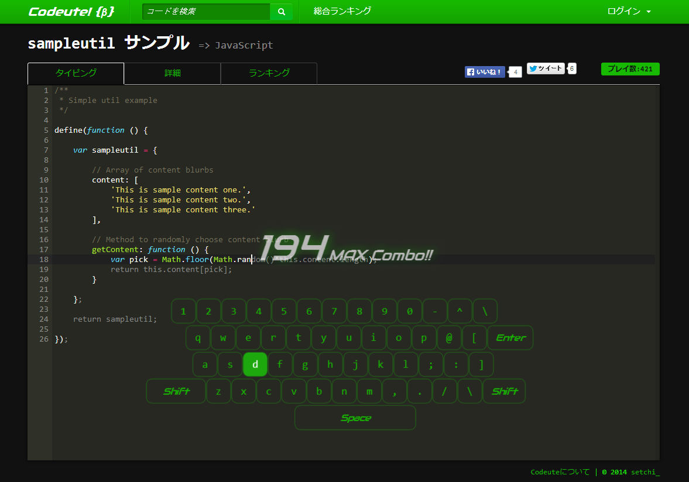
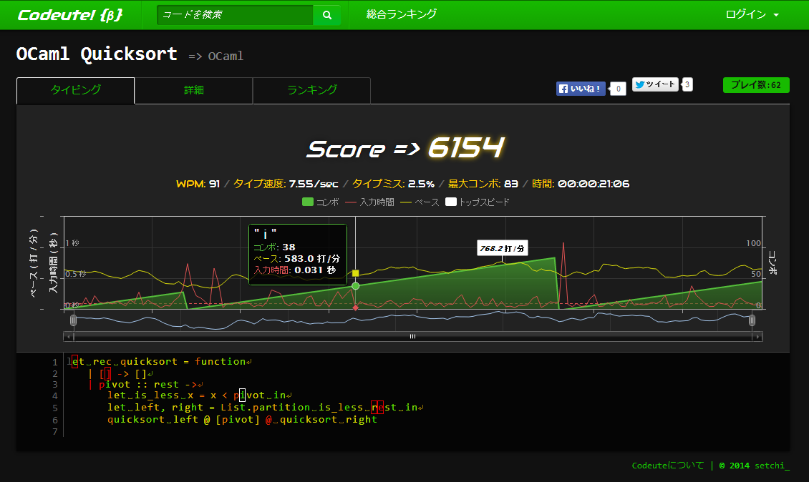

Codeute!
=======
コーデュートは、書いたコードをタイピングゲームにして遊べるWebアプリです。

* [https://codeute.com/](https://codeute.com/)
 * JavaScriptのサンプル: [https://codeute.com/javascript/1](https://codeute.com/javascript/1)

SNSアカウント(Facebook, Twitter, GitHub)でログインして、好きなコードをアップロードしてタイピング練習できます。総合ランキングでユーザー同士で競い合えます。

コードは、とりあえず動くことを優先したものが多いので全体的に汚いです。

プレイ画面
--------------------

結果画面
--------------------

動作環境
--------------------
下記の環境で動作を確認しています。

* Apache 2.2.3
* PHP 5.3.3
* MySQL 5.0.95

ビルド
--------------------
* fuel/app/config/内のdb.phpとopauth.phpの設定が必要です。

Copyright
--------------------
Copyright &copy; 2011 setchi_. See LICENSE for details.